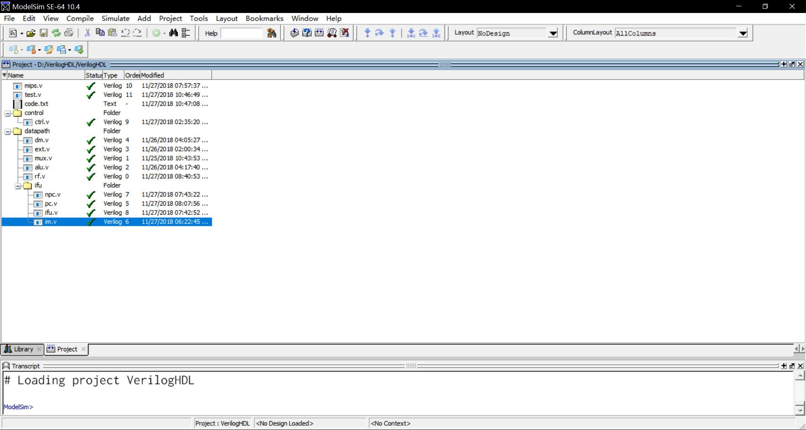
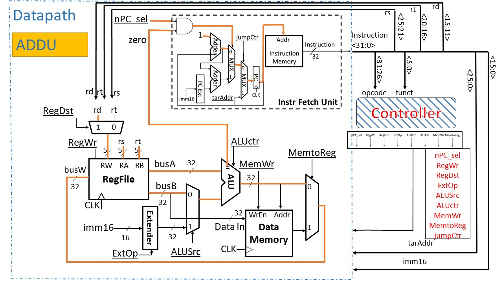
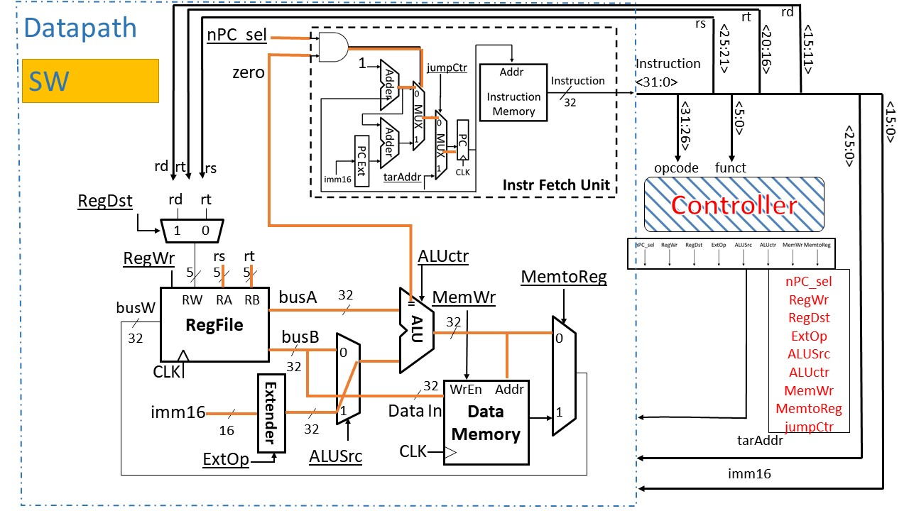
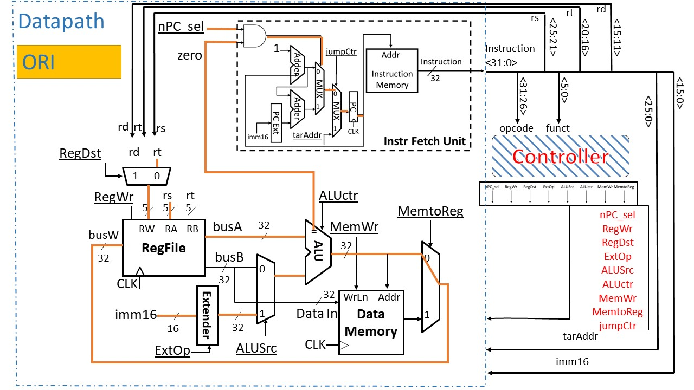
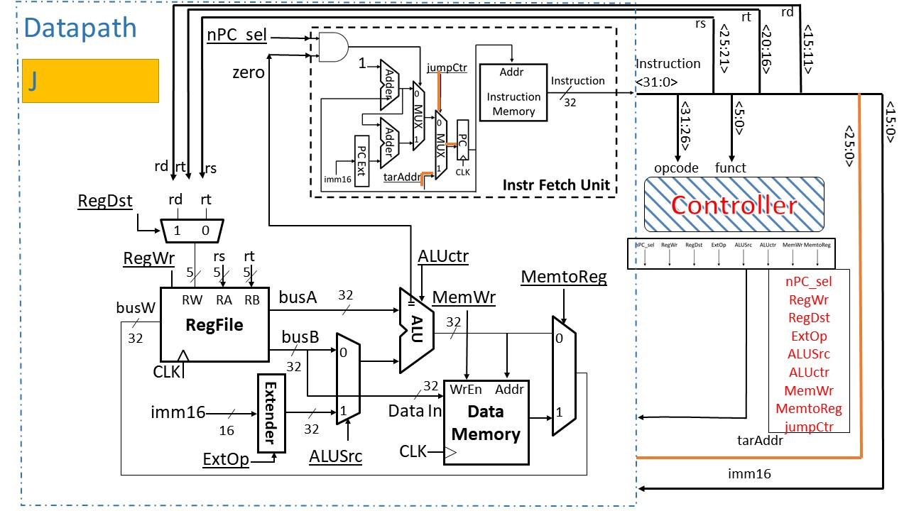
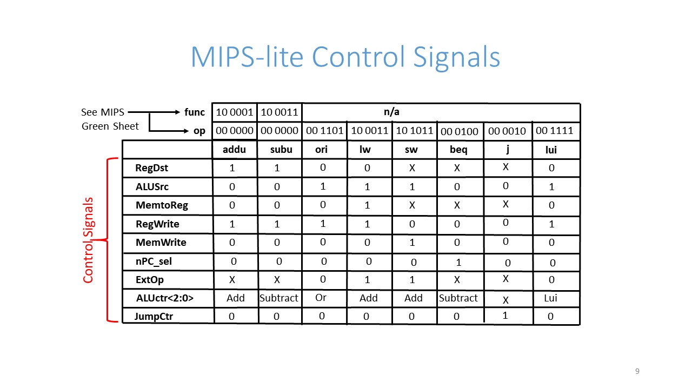

# Verilog HDL 实现单周期 MIPS 处理器
---
单周期MIPS处理器仿真
实现命令：addu，subu，ori，lui，lw，sw，beq，j

---
## 开发环境
Window 10
ModelSim SE-64 10.4

---
## 目录结构

---
## 组件

### mips.v
组合所有部件，仅有时钟与重置信号输入

### test.v
测试程序

### code.txt
测试指令

### ctrl.v
控制器，用于解析指令并分解为信号

### dm.v
数据内存，大小为 1024 × 32 bit

### ext.v
16位数扩展为32位数，可零扩展和符号扩展

### mux.v
32位选择器，根据0和1决定输出

### alu.v
算术与逻辑组件，可以计算 +，-，|以及相等以及拼接

### rf.v
寄存器，32 × 32 bit

### npc.v
用于计算下一个pc指令的位置

### pc.v
程序指令计数器，时钟上升沿时触发，30 bits，可被重置，初始值 0x0000_0c00

### ifu.v
组合npc、pc、im为ifu，用于取址

### im.v
指令内存，大小为 1024 × 32 bit

---
## 各指令设计线路与信号

